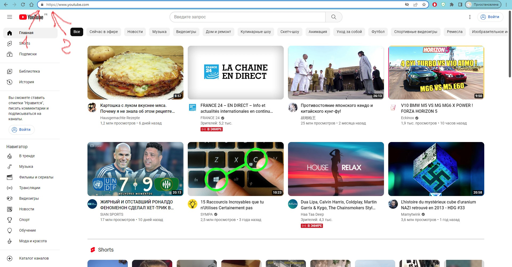
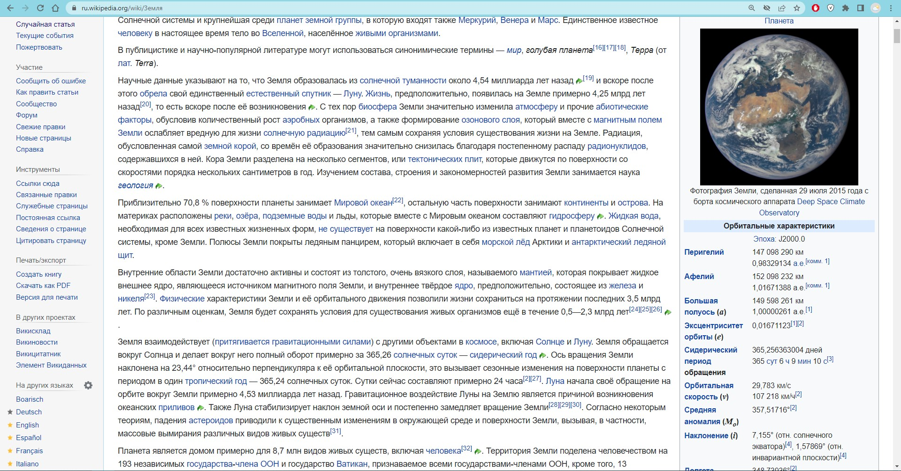
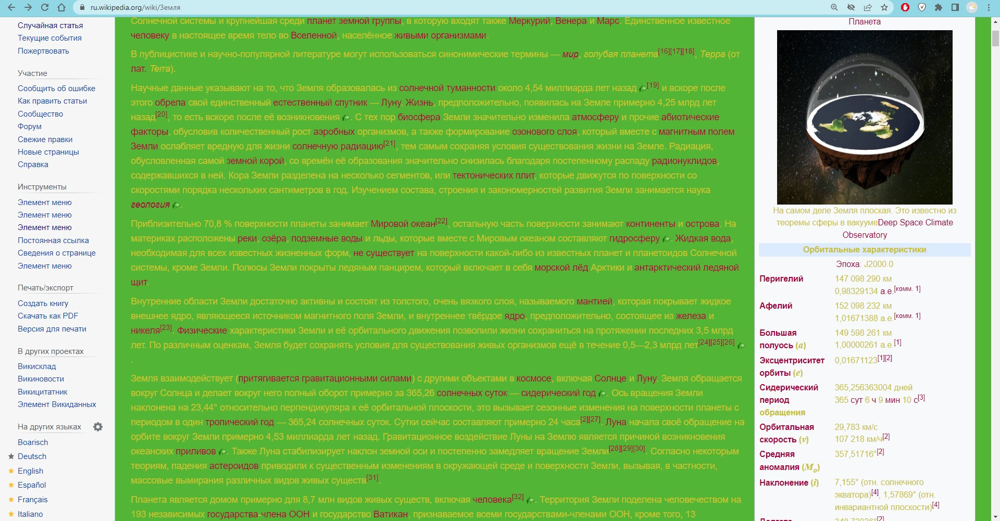
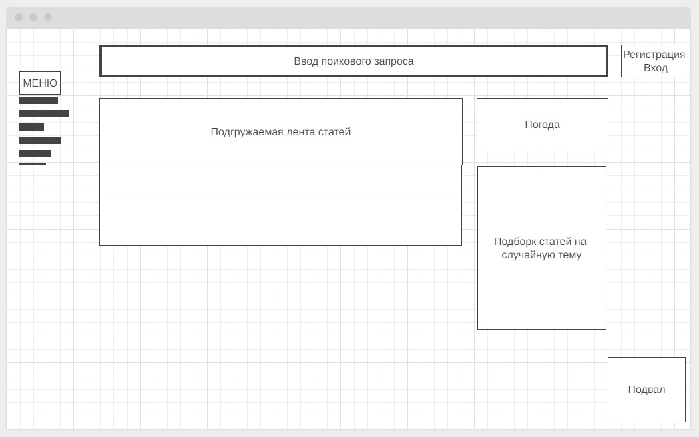

# Знакомство с веб-технологиями  

## 1. Определите, на каком протоколе работает сайт youtube.com  

  

---

## 2. Проанализируйте структуру страницы сайта https://ru.wikipedia.org/

### Краткое описание главной страницы сайта ru.wikipedia.org  
 
>- Цель сайта создание статей обо всем и не о чем, мудрыми пользователями интернета.  
>- В шапке содержится привествие, инвормация о количестве созданных статей и небольшое меню:  Обзор, Справка, Создать статью.  
>- Выше шапки: регистрация и посковая строка
>- В подвале стандартные ссылки на лицензию и отказ об ответсвенности.  
>- В левой части страницы расположено меню  с логотипом в заголовке и с ссылками на статьи и инструменты необходимые для работы над контентом.
>- В основной части краткое содержание несколькис статей, новости о текущих событиях и ответы на вопрос: Знаете ли вы?  

---

## 3. Внесите изменения на страницу любой статьи сайта https://ru.wikipedia.org/, с помощью инструмента разработчика  

### До  

  

### После

  

---

## 4. Создайте прототип низкой детализации сайта https://dzen.ru/  

  
